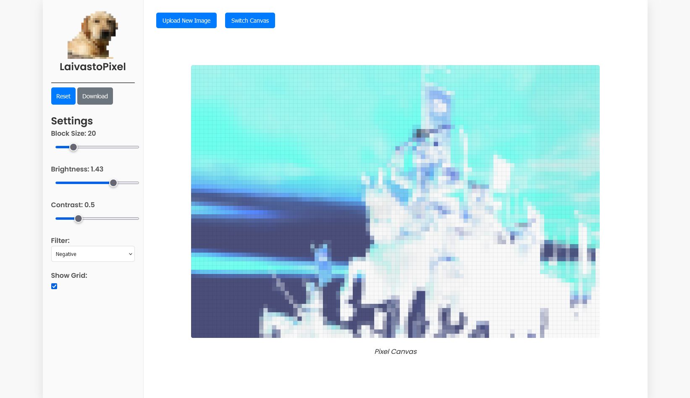

<picture>
  
</picture>

# LaivastoPixel - Pixel Art Generator

LaivastoPixel is a pixel art generator library designed to convert images into pixel art. I made this after beeing disapointed by another librairy.

**Important Note:**
This project is a prototype created in just a few hours. It is still in its early stages and will evolve over time (Not yet).
## Getting Started
### Prerequisites
- A modern web browser (e.g., Chrome, Firefox, Edge).
- Server to run index.html (example app)

###  Installation
1. Clone the repository:

```BASH
git clone https://github.com/yourusername/laivastopixel.git
cd laivastopixel
```
2. Open the project:
Open `index.html` in your web browser. **It may not work, and you may have need to use a localserver**.

base url is `src/`, if this isn't the root feel free to make an `.htaccess`
3. feel free to use it and discover as your wish.
example of page


## Usage

Initialize the Library:

```JS
const pixelMaster = new LaivastoPixel();
```

Load an Image:

```JS
pixelMaster.loadImage(file).then(() => {
    // Image loaded and pixelation applied
});
```

Adjust Settings:

```JS
pixelMaster.setPixelSize(10);
pixelMaster.setBrightness(1.2);
pixelMaster.setContrast(1.5);
pixelMaster.setColorPalette('grayscale');
```

Download the Pixelated Image:

```JS
pixelMaster.downloadImage();
```

Reset the Canvas:

```JS
pixelMaster.resetCanvas();
```

## Contributing
Contributions are welcome! Please follow these steps to contribute:
1. Fork the repository.
2. Create a new branch (git checkout -b feature-branch).
3. Commit your changes (git commit -am 'Add new feature').
4. Push to the branch (git push origin feature-branch).
5. Open a pull request.

## Working on
I am currently focused on simplifying the usage of this project. My goal is to making it more intuitive and accessible.

Once this improvement is in place, I will proceed to implement new functionalities to enhance the overall capabilities of the project.

## License

This project is licensed under the GNU General Public License v3.0.
